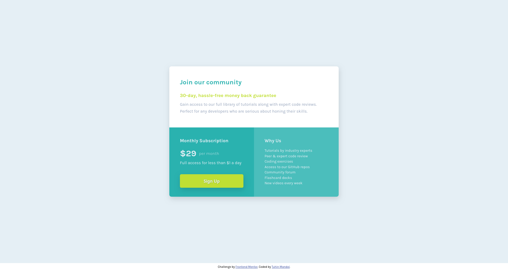

# Frontend Mentor - Single price grid component solution

This is a solution to the [Single price grid component challenge on Frontend Mentor](https://www.frontendmentor.io/challenges/single-price-grid-component-5ce41129d0ff452fec5abbbc). Frontend Mentor challenges help you improve your coding skills by building realistic projects.

## Table of contents

- [Overview](#overview)
  - [The challenge](#the-challenge)
  - [Screenshot](#screenshot)
  - [Links](#links)
- [My process](#my-process)
  - [Built with](#built-with)
  - [What I learned](#what-i-learned)
  - [Continued development](#continued-development)
  - [Useful resources](#useful-resources)
- [Author](#author)
- [Acknowledgments](#acknowledgments)

**Note: Delete this note and update the table of contents based on what sections you keep.**

## Overview

### The challenge

Users should be able to:

- View the optimal layout for the component depending on their device's screen size
- See a hover state on desktop for the Sign Up call-to-action

### Screenshot

### Links

- Solution URL: [Add solution URL here](https://your-solution-url.com)
- Live Site URL: [Live Site](https://single-price-grid-component-main-tm.netlify.app/)

## My process

### Built with

- Semantic HTML5 markup
- CSS custom properties
- Flexbox
- Mobile-first workflow

### What I learned

- The use of `text-shadow` property in CSS to create a glowing effect on text.
- Use of margin for spacing things.
- Using flexbox and flex-wrap to make things responsive without needing media queries.
- Using flex-basis to set the initial size of flex items.

### Continued development

I want to keep improving at:

- CSS layouts (especially grid for more complex designs).
- Writing cleaner, scalable CSS for bigger projects.

### Useful resources

- [Mozilla Developer Network](https://developer.mozilla.org/en-US/docs/Web/CSS/Reference) - This helped me in understanding how to use different CSS properties.

## Author

- Website - [Tuhin Mandal](https://tuhin-mandal-portfolio.vercel.app/)
- Frontend Mentor - [@MandalTuhin](https://www.frontendmentor.io/profile/MandalTuhin)

## Acknowledgments

- Thanks to [Frontend Mentor](https://www.frontendmentor.io) for providing the challenge and design resources.
  ➜ blog-preview-card-main git:(main)
